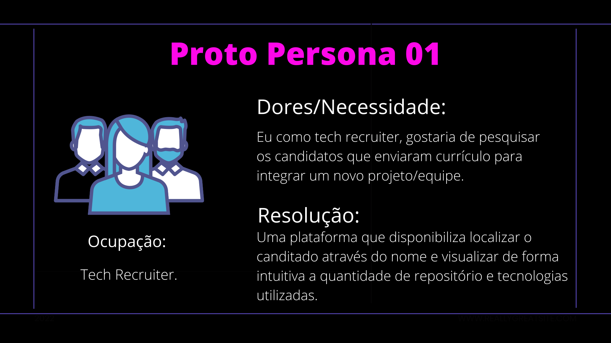
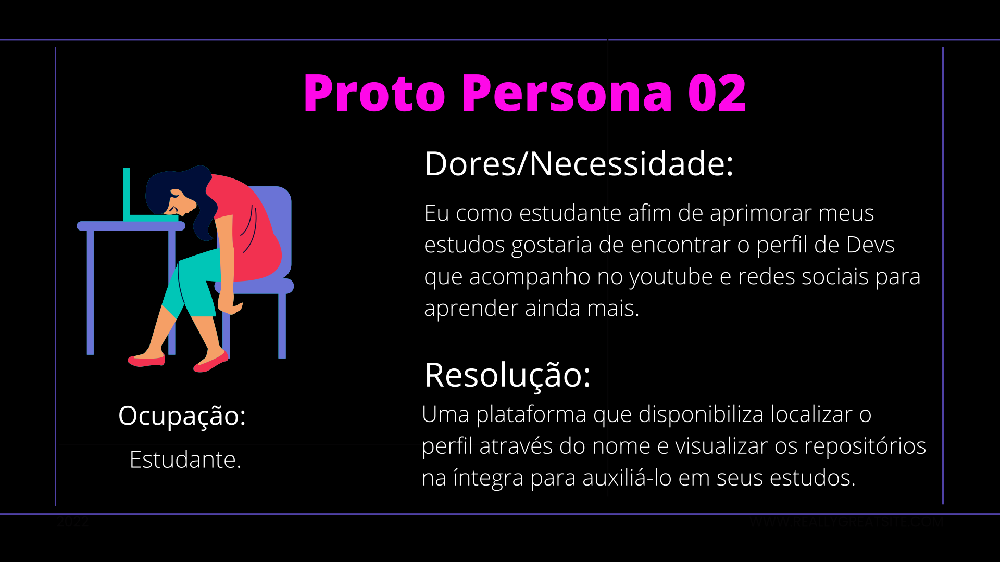
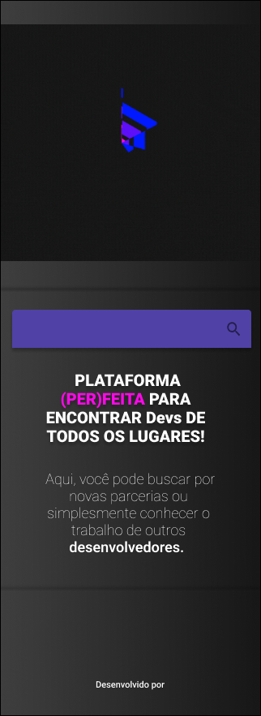
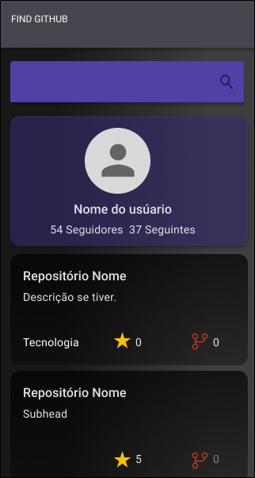
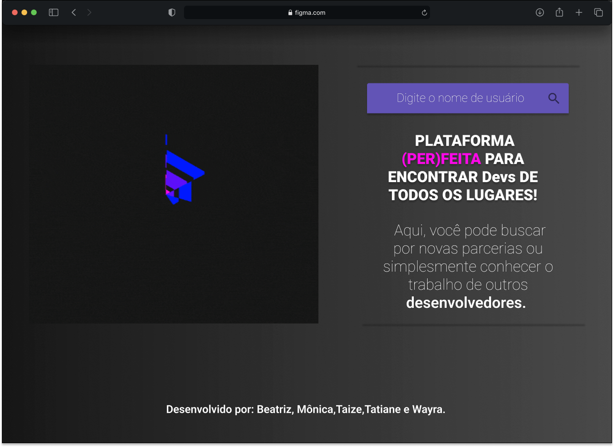
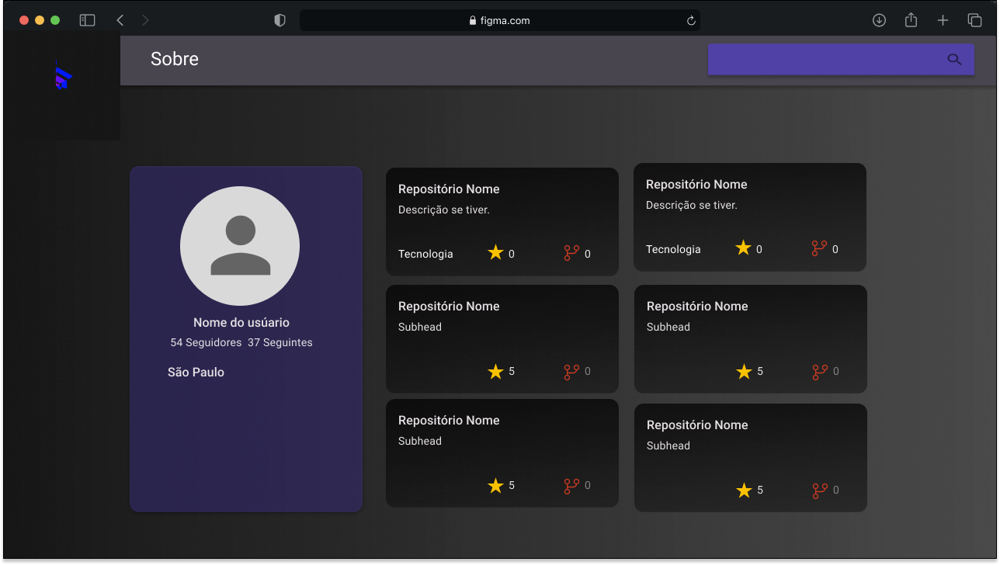

</a> 

## Índice

* [1. Introdução.](#1-introdução)
* [2. Interface de usuário.](#2-interface-de-usuário)
* [3. Como usar.](#3-como-usar)
* [4. Ferramentas utilizadas.](#4-ferramentas-utilizadas)
* [5. Implementações futuras](#5-implementações-futuras)
* [6. Desenvolvedoras ](#5-desenvolvedoras)

## 1. Introdução
O Finder Github é uma aplicação para encontrar perfis de Dev's e seus repositórios dentro de uma das maiores plataformas utilizadas no mundo da programação, o GitHub. Você pode buscar por novas parcerias ou simplesmente conhecer o trabalho de outros desenvolvedores. [Acesse](https://sap007-tf-elo.vercel.app/) e aproveite! 
Projeto desenvolvido para o evento de hackaton promovido pelo bootcamp de front-end da Laboratoria-BR(SAP007).

---
## 2. Interface de usuário
A interface foi desenvolvida para funcionar de maneira simples e intuitiva, para facilitar a busca de usuários e repositórios, inclusive, por pessoas que não possuem tanta familiaridade com o GitHub. Com poucos cliques é possível encontrar exatamente o que se procura. 

### Proto Personas

   

 

   

---

### Protótipo de Alta fidelidade
 
O Protótipo foi criado pelo FIGMA, abaixo o protótipo Mobile:
 

   
   

 
Protótipo Desktop:

   
   

---
## 3. Como usar?

### Primeiros passos:

1. Para rodar o Finder GitHub, recomendamos baixar e instalar o [Visual Studio Code](https://code.visualstudio.com/). Se preferir, existem outros editores no mercado e você pode usá-los.
2. Para executar os comandos você precisará de um  UNIX Shell, que é um programa que interpreta linhas de comando (command-line interpreter) e também deve ter o git instalado. Se você usa um sistema operacional "UNIX-like", como GNU/Linux ou MacOS, você já tem um shell (terminal) instalado (e provavelmente o git também). Se você usa o Windows, pode utilizar a versão completa do [Cmder](https://cmder.net/) que já inclui o Git bash.
3. Instale o [Node.js](https://nodejs.org/en/download/) (que inclui o npm).
4. [Clone o projeto](https://docs.github.com/pt/repositories/creating-and-managing-repositories/cloning-a-repository) para a sua máquina, abra o terminal e execute os seguintes comandos:

`$ git clone https:/`

Instalar as dependências do projeto no computador (cópia local).

`$ npm install or yarn install`

Crie um arquivo com o formato `.env` ([siga o exemplo](https://www.youtube.com/watch?v=_HGDTCQYoDc&feature=youtu.be )).
Em seguida, crie um token no GitHub, esse token deverá ser colocado no arquivo `env.` O token pode ser gerado sem escopo, ou seja, sem marcar as opções de permissões. Para gerar um token siga o [link](https://github.com/settings/tokens/new).

Iniciar a aplicação

`$ npm start or yarn start`

Realizar os testes unitários

`$ npm test or yarn testClone` 

---

## 4. Ferramentas utilizadas
Utilização do Trello para organização durante as Sprints do projeto, realizando a divisão de baby steps para as tarefas desenvolvidas, geradas a partir do Backlog.
Realização das cerimônias de metodologia ágil: Daily, Sprint Planning, Sprint Review, Sprint Retrospective, e Sprint Checkout. Todos os dados de usuários encontrados nessa aplicação, são consumidos através da [API REST](https://docs.github.com/pt/rest) do GitHub. Além disso, o projeto foi desenvolvido através do processo `TDD`(Test Driven Development - Desenvolvimento Orientado a Testes).  
 
 

    
    
    
    
    
    
    
    
    
    
    
    

 
 

| Tools | Version |
|---|---|
**Node.js** |  v16.13.1 | 
**Npm** | 8.1.2 |
**React** | 18.2.0 |
**Mui/icons-material** | 5.8.4 |
**Mui/material** | 5.8.6 |
**Octokit** | 1.8.1 |
**React-router-dom** | 6.3.0 |

---
 
 

## 5. Implementações futuras

Futuramente, o campo de busca será aprimorado. O objetivo é ampliar as possibilidades de busca do usuário, assim será possível pesquisar por nome de repositório, tecnologias utilizadas e localização do usuário.  

---
 
 

##  6. Desenvolvedoras

| [ Beatriz Carvalho](https://github.com/BeaSCarvalho) |  [ Mônica Guimaraes](https://github.com/MonicaGuimaraes) |  [ Taize Santos](https://github.com/taizesantos)  | [ Tatiane Mendonça](https://github.com/Tati-Mendonca)  | [ Wayra Arendartchuk](https://github.com/WayraArendartchukCastro)  |
| :---: | :---: | :---: | :---: | :---:

